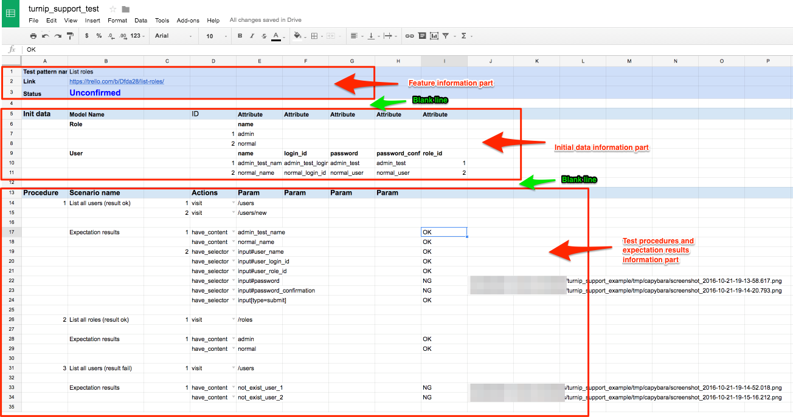
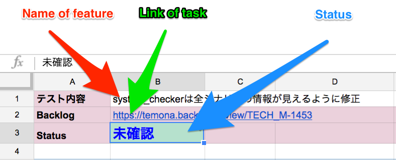
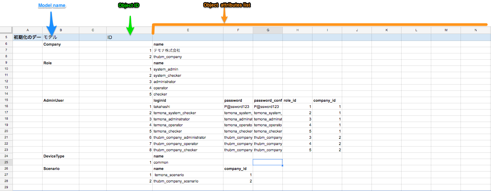
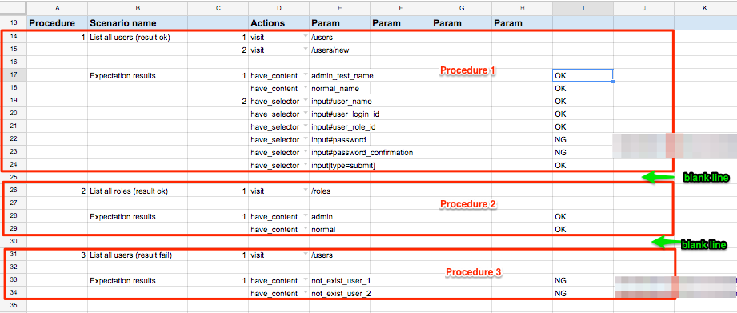
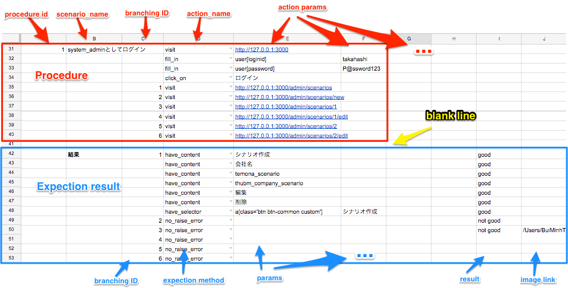

# turnip-support
--------------------------------------------------------------------------------
**turnip-support** is the tool that support testing features of Rails applications.


## Table of contents:
--------------------------------------------------------------------------------
- [Requirements](#requirements)
- [Install](#install)
- [How to use](#how-to-use)
- [Test pattern spread sheet](#test-pattern-spread-sheet)
  - [Feature information part](#feature-information-part)
  - [Initial data information part](#initial-data-information-part)
  - [Test procedure and expectation result information part](#test-procedures-and-expectation-results-information-part)
- [Configuration](#configuration)
- [All support actions](#all-support-actions)
- [All support expection methods](#all-support-expection-methods)

## Requirements
--------------------------------------------------------------------------------

For using **turnip-support**, the Rails application must be installed all below gems:
- [factory_girl](https://github.com/thoughtbot/factory_girl)
- [google_drive](https://github.com/gimite/google-drive-ruby)
- [turnip](https://github.com/jnicklas/turnip)
- [capybara](https://github.com/jnicklas/capybara)
- [capybara-screenshot](https://github.com/mattheworiordan/capybara-screenshot)
- [capybara-webkit](https://github.com/thoughtbot/capybara-webkit)

## Install
--------------------------------------------------------------------------------


## How to use
--------------------------------------------------------------------------------

### Test pattern spread sheet

First, you must create a test pattern spread sheet has template like below link: [Test pattern template](https://docs.google.com/spreadsheets/d/1es49-XMXjFLLKxtm1Te0kUTWxGGbbQPliaSq-6ku2RI/edit#gid=244159565)

I will show you the structure of the test case you must create:

The test case's structure has 3 main parts as below:
- [Feature information part](#feature-information-part)
- [Initial data information part](#initial-data-information-part)
- [Test procedure and expectation result information part](#test-procedures-and-expectation-results-information-part)

Parts must be seperated by **1 blank line**.




#### Feature information part

The feature information part contains first 3 lines. You must set value for 3 cells:
  - **B1** : Name of feature.
  - **B2** : Link of task.
  - **B3** : Status



#### Initial data information part
The initial data information part must be start from line 5. The structure is:
  - Column **B** : Model name.
  - Column **D** : Object ID. This is the id that will be set to the object when creating object.
  - Column **E** ~ last column: Object's attributes. This informations will be set to object as attributes when creating object.

The objects list should be grouped by model name. When you want to create objects of a new model, please input to the start line below informations:
  - column **B**: The model name. Example: Company
  - column **E** ~ : The model attributes name you want to change.



In above sample, I want to:
  - create objects of model `Company` and custom `name` attribute of each object.
  - create object of model `Role` and custom `name` attribute of each object.
  - create object of model `AdminUser` and custom `loginid`, `password`, `password_confirmation`, `role_id` and `company_id` of each object. ...

#### Test procedures and expectation results information part
The test procedures and expectation results information part must be start from line that distances the initial data information part by 1 line.
  - This part can contains many procedures that are seperated by 1 blank line.



  - The structure of each action part:
    - Column **A** : Procedure order number (ID).
    - Column **B** : Scenario name.
    - Column **C** : Branching ID.
    - Column **D** : Action name. See [All supported actions]().
    - Column **E** ~ last column: The params corresponding with each action.


  - The structure of each expectation result part:
    - Column **C** : Branching ID.
    - Column **D** : Expectation method name. See [All expection methods]()
    - Column **E** ~ last column: The params corresponding with each expectation method.
    - Column **I** : The default column of test result.
    - Column **J** : The default column of test image.




### Configuration

For each feature, you must create new *.yml* file with below contents and put it to folder `PROJECT_FOLDER/spec/configs`.
You should set name of this file for easily understanding the feature name.

Sample: `system_user_scenario.yml`

```
spreadsheet_key: YOUR_SPREADSHEET_KEY               # required
config_file: YOUR_CONFIG_FILE                       # required
worksheet_order_number: SPECIFICED_WORKSHEET_NUMBER # required
model_name_col: 2                                   # optional
obj_id_col: 4                                       # optional
obj_attr_start_col: 5                               # optional
action_name_col: 4                                  # optional
action_params_start_col: 5                          # optional
expect_method_name: 4                               # optional
expect_params_start_col: 5                          # optional
result_col: 9                                       # optional
image_col: 10                                       # optional
result_message:                                     # optional
  ok: "good"                                        # optional
  ng: "not good"                                    # optional
```

- **spreadsheet_key**: You can find spreadsheet_key from the link of spreadsheet. This attribute is **required**!

Example:

Spreadsheet link: https://docs.google.com/spreadsheets/d/ `1es49-XMXjFLLKxtm1Te0kUTWxGGbbQPliaSq-6ku2RI`/edit#gid=244159565

→ spreadsheet_key: `1es49-XMXjFLLKxtm1Te0kUTWxGGbbQPliaSq-6ku2RI`

- **config_file**: Please reference [google-drive-ruby: Authorization](https://github.com/gimite/google-drive-ruby/blob/master/doc/authorization.md).
  The config_file must be placed into `PROJECT_FOLDER/spec/configs` folder.
  This attribute is **required**!

- **worksheet_order_number**: the order number of worksheet in spreadsheet, is counted from 0. This attribute is **required**!

- **model_name_col**: The model name column.
  This attribute is **optional**!
  Defaut value is **B**. If you not set, default value is setted.

- **obj_id_col**: The object id column.
  This attribute is **optional**!
  Defaut value is **D**. If you not set, default value is setted.

- **obj_attr_start_col**: The start column to define object attributes.
  This attribute is **optional**!
  Defaut value is **E**. If you not set, default value is setted.

- **action_name_col**: The action name column.
  This attribute is **optional**!
  Defaut value is **D**. If you not set, default value is setted.

- **action_params_start_col**: The start column of params for actions.
  This attribute is **optional**!
  Defaut value is **E**. If you not set, default value is setted.

- **expect_method_name**: The expectation method name column.
  This attribute is **optional**!
  Defaut value is **D**. If you not set, default value is setted.

- **expect_params_start_col**: The start column of params for expectation methods.
  This attribute is **optional**!
  Defaut value is **E**. If you not set, default value is setted.

- **result_col**: The result column.
  This attribute is **optional**!
  Defaut value is **I**. If you not set, default value is setted.

- **image_col**: The image link column.
  This attribute is **optional**!
  Defaut value is **J**. If you not set, default value is setted.

- **result_message**: The messsage of each result, contains 2 values: **ok** and **ng**.
  This is the message displayed in the spreadsheet after running test.
  This attribute is **optional**!
  Default value is: **OK** and **NG**. If you not set, default value is setted.

### All support actions

The basic action is same with the action what is proviced by [capybara](https://github.com/jnicklas/capybara). Params for each actions is same too.

- [visit](https://github.com/jnicklas/capybara#navigating)
- [click_link](https://github.com/jnicklas/capybara#clicking-links-and-buttons)
- [click_button](https://github.com/jnicklas/capybara#clicking-links-and-buttons)
- [click_on](https://github.com/jnicklas/capybara#clicking-links-and-buttons)
- [fill_in](https://github.com/jnicklas/capybara#interacting-with-forms)
- [choose](https://github.com/jnicklas/capybara#interacting-with-forms)
- [check](https://github.com/jnicklas/capybara#interacting-with-forms)
- [uncheck](https://github.com/jnicklas/capybara#interacting-with-forms)
- [attack_file](https://github.com/jnicklas/capybara#interacting-with-forms)
- [select](https://github.com/jnicklas/capybara#interacting-with-forms)
- [execute_script](https://github.com/jnicklas/capybara#scripting)
- custom_action: For the `custom_action` action, you must provide below params:
  - step name
  - params for corresponding step

Your custom step should be placed in `PROJECT_FOLDER/spec/steps` folder. Reference [turnip](https://github.com/jnicklas/turnip) to write your custom step.

### All support expection methods

- have_current_path:
```
page.current_url == data[0]
```
- have_selector:
```
if data[1].present?
    expect(find("#{data[0]}")).to have_content data[1]
else
    expect(page).to have_selector data[0]
end
```
- have_xpath
```
expect(page).to have_xpath data[0]
```
- have_css
```
expect(page).to have_css data[0]
```
- have_content
```
expect(page).to have_content data[0]
```
- no_have_current_path:
```
page.current_url != data[0]
```
- no_have_selector
```
if data[1].present?
    expect(find("#{data[0]}")).not_to have_content data[1]
else
    expect(page).not_to have_selector data[0]
end
```
- no_have_xpath
```
expect(page).not_to have_xpath data[0]
```
- no_have_css
```
expect(page).not_to have_css data[0]
```
- no_have_content
```
expect(page).not_to have_content data[0]
```
- raise_error
```
expect(page).to have_selector "section.backtrace"
```
- no_raise_error
```
expect(page).not_to have_selector "section.backtrace"
```
- custom_expect: For the `custom_expect` method, you must provide below params:
  - step name
  - params for corresponding step

Your custom step should be placed in `PROJECT_FOLDER/spec/steps` folder. Reference [turnip](https://github.com/jnicklas/turnip) to write your custom step.
